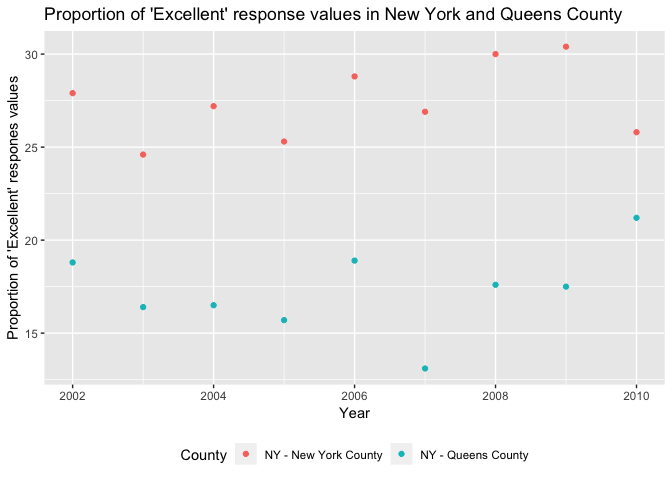

P8105\_hw2\_dry2115
================
Dayoung Yu
2018-10-05

Problem 1
---------

Read and clean nyc transit data:

``` r
transit_df = 
  read_csv(file = "./data/nyc_transit_data.csv") %>%
  janitor::clean_names() %>%
  select(line, station_name, station_latitude, station_longitude, starts_with("route"), 
        entry, vending, entrance_type, ada) %>%
  mutate(entry = ifelse(entry == "YES", TRUE, FALSE))
```

    ## Parsed with column specification:
    ## cols(
    ##   .default = col_character(),
    ##   `Station Latitude` = col_double(),
    ##   `Station Longitude` = col_double(),
    ##   Route8 = col_integer(),
    ##   Route9 = col_integer(),
    ##   Route10 = col_integer(),
    ##   Route11 = col_integer(),
    ##   ADA = col_logical(),
    ##   `Free Crossover` = col_logical(),
    ##   `Entrance Latitude` = col_double(),
    ##   `Entrance Longitude` = col_double()
    ## )

    ## See spec(...) for full column specifications.

The data set *transit df* contains information on entrance specifications as well as available routes and ADA compliancy for each subway station in New York City. The variables included are: line, station\_name, station\_latitude, station\_longitude, route1, route2, route3, route4, route5, route6, route7, route8, route9, route10, route11, entry, vending, entrance\_type, ada. These variables were specifically selected from the parent NYC\_Transit\_Subway\_Entrance\_And\_Exit\_Data dataset. The janitor function was used to clean the variable names and the entry variable was converted from character type to logical. The dimensions of *transit df* are 19 columns by 1868 rows. These data are not tidy because the route1-route11 columns should be collapsed into one column.

``` r
stations_df = distinct(transit_df, station_name, line, .keep_all = TRUE)
  distinct_stations = nrow(stations_df)
  ada_compliant = nrow(filter(stations_df, ada == TRUE))
  
  without_vending = nrow(filter(stations_df, vending == "NO"))
  entrance_without_vending = nrow(filter(stations_df, vending == "NO", entry == TRUE))
  prop_entrance = round((entrance_without_vending / without_vending), digits = 3)
```

There are 465 distinct stations in the data set. 84 stations are ADA compliant. The proportion of non-vending stations that allow entry is 0.556.

``` r
transit_tidy_df = gather(transit_df, key = route_number, value = route_name, route1:route11)

  a_stations = 
    filter(transit_tidy_df, route_name == "A") %>%
    distinct(station_name, line) %>%
    nrow()
  
  compliant_a_stations = 
    filter(transit_tidy_df, route_name == "A", ada == TRUE) %>%
    distinct(station_name, line) %>%
    nrow()
```

60 distinct stations serve the A train. Of those stations, 17 stations are ADA compliant.

Problem 2
---------

Read and clean Mr. Trash Wheels data:

``` r
library(readxl)

trash_df = 
  read_excel("./data/trashwheel_data_updated.xlsx", sheet = 1, range = cell_cols("A:N")) %>%
  janitor::clean_names() %>%
  filter(dumpster != is.na(dumpster)) %>%
  mutate(
    sports_balls = as.integer(round(sports_balls, digits = 0))
  )
```

Read and clean precipitation data:

``` r
prcp16_df = (
  read_excel("./data/trashwheel_data_updated.xlsx", sheet = 5, range = cell_rows(2:14)) %>%
  janitor::clean_names() %>%
  rename(total_prcp = total) %>%
  mutate(year = 2016))

prcp17_df = (
  read_excel("./data/trashwheel_data_updated.xlsx", sheet = 4, range = cell_rows(2:14)) %>%
  janitor::clean_names() %>%
  rename(total_prcp = total) %>%
  mutate(year = 2017))
```

Combine precipation data from 2016 and 2017:

``` r
prcp1617_df = (
  bind_rows(prcp16_df, prcp17_df) %>%
  mutate(month = month.name[month]))
```

Problem 3
---------

Install p8105 data package:

``` r
devtools::install_github("p8105/p8105.datasets")
```

    ## Skipping install of 'p8105.datasets' from a github remote, the SHA1 (21f5ad1c) has not changed since last install.
    ##   Use `force = TRUE` to force installation

``` r
library(p8105.datasets)
data(brfss_smart2010)
```

Clean brfss data:

``` r
brfss_df = (
  brfss_smart2010 %>%
  janitor::clean_names() %>%
  filter(topic == "Overall Health") %>%
  select(year, locationabbr, locationdesc, response, data_value) %>%
  spread(key = response, value = data_value) %>%
  janitor::clean_names() %>%
  mutate(excellent_or_very_good = (excellent + very_good)))
```

Calculate location stats:

``` r
distinct_locations = nrow(distinct(brfss_df, locationdesc))
distinct_state = nrow(distinct(brfss_df, locationabbr))

brfss_df %>%
  group_by(locationabbr) %>%
  summarize(n = n()) %>%
  filter(min_rank(desc(n)) < 2)
```

    ## # A tibble: 1 x 2
    ##   locationabbr     n
    ##   <chr>        <int>
    ## 1 NJ             146

In the BRFSS SMART 2010 data, there are 404 distinct locations. Since there are 51 distinct states (including DC) in the data, every state is represented. New Jersey was the state that was observed the most.

Find median "Excellent" response values:

``` r
brfss_df %>%
  group_by(year) %>%
  summarize(median_excellent = median(excellent, na.rm = TRUE))
```

    ## # A tibble: 9 x 2
    ##    year median_excellent
    ##   <int>            <dbl>
    ## 1  2002             23.6
    ## 2  2003             23.7
    ## 3  2004             22.2
    ## 4  2005             21.6
    ## 5  2006             22.2
    ## 6  2007             21.4
    ## 7  2008             21.8
    ## 8  2009             21.5
    ## 9  2010             21.2

In 2002, the median of the "Excellent" response value was 23.6.

Make a histogram and scatterplot of "Excellent" response values:

``` r
brfss_df %>%
  filter(year == "2002") %>%
  ggplot(., aes(x = excellent)) + 
    geom_histogram() + 
    labs(
      title = "`Excellent` response values in 2002",
      x = "`Excellent` response values",
      y = "Count")
```

    ## `stat_bin()` using `bins = 30`. Pick better value with `binwidth`.

    ## Warning: Removed 2 rows containing non-finite values (stat_bin).


``` r
new_york = 
  brfss_df %>%
  filter(locationdesc == "NY - New York County")

queens = 
  brfss_df %>%
  filter(locationdesc == "NY - Queens County")

ny = (rbind(new_york, queens) %>%
        rename(County = locationdesc))
  

ggplot(ny, aes(x = year, y = excellent, color = County)) +
    geom_point() + 
    labs(
      title = "Proportion of 'Excellent' response values in New York County and Queens County",
      x = "Year",
      y = "Proportion of 'Excellent' respones values"
    ) + 
    theme(legend.position = "bottom")
```


